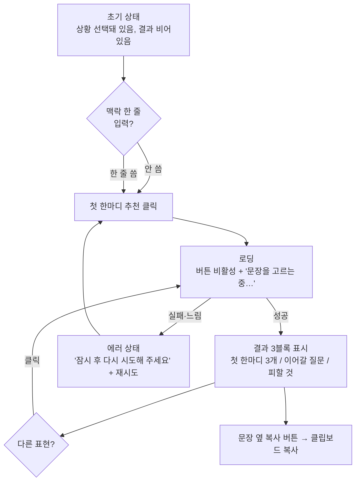

# 첫 한마디 도우미 — AI 화면 흐름 설계

> 말문 1순위 AI 기능. 기존 `tools.html`의 "첫 한마디 도우미" 카드를 **정적 랜덤 → 상황 맞춤 AI 생성**으로 교체하는 설계 문서.
> 새 화면을 만들지 않고 기존 UX(상황 선택 → 버튼 → 결과)를 그대로 유지하는 것이 핵심.

---

## 1. 설계 원칙

| 원칙 | 의미 |
|------|------|
| 입력 최소 | 버튼 한 번으로 동작. 맥락 한 줄은 **선택 입력**(안 써도 됨). |
| 명령이 아니라 선택지 | 정답 하나가 아니라 **첫 한마디 3개**를 제안. 고르는 부담을 낮춤. |
| 안전 우선 | 작업 멘트·과한 친밀·상대 평가·사생활 침습 질문 배제. 담백한 톤. |
| 프라이버시 | 입력은 생성에만 사용, 서버 저장 없음. 화면에 한 줄로 안심 문구. |

---

## 2. 카드 구성 (Before → After)

**Before (현재)**
- 태그: `첫 한마디 도우미`
- 제목: "상황별로 이렇게 시작해보세요"
- 상황 드롭다운 1개
- 결과 영역(정적 랜덤 문장 1개)
- 버튼: `첫 한마디 추천` / `다른 표현`

**After (AI)** — 추가/변경되는 요소만 표기
- 상황 드롭다운 (그대로 유지)
- **[추가] 맥락 한 줄 입력** (선택) — placeholder: "예: 옆자리 신입인데 아직 서먹해요"
- 결과 영역이 **구조화된 3블록**으로 확장 (아래 §5)
- 각 첫 한마디 옆 **복사 버튼**
- 버튼: `첫 한마디 추천` / `다른 표현`(재생성, 유지)
- 결과 하단 **프라이버시 한 줄**: "입력한 내용은 추천에만 쓰이고 저장되지 않아요."

---

## 3. 상황 드롭다운 값 (기존 유지)

| value | 라벨 |
|-------|------|
| `training` | 신입교육 · 처음 만난 동기 |
| `lunch` | 점심시간 |
| `break` | 쉬는시간 |
| `firstday` | 첫 출근 · 새 학기 |
| `network` | 모임 · 네트워킹 |

AI에는 라벨 텍스트를 그대로 전달해 상황 맥락으로 사용.

---

## 4. 사용자 흐름 (상태별)



### 상태 정의
1. **초기** — 페이지 로드 시. 상황은 첫 항목 선택됨, 결과 영역은 안내 문구("상황을 고르고 버튼을 눌러보세요").
2. **로딩** — 버튼 비활성화, 문구 "문장을 고르는 중…". 중복 클릭 방지.
3. **결과** — §5 구조로 렌더. 애니메이션은 기존 `.result` 스타일 재사용.
4. **재생성** — `다른 표현` 클릭 시 같은 입력으로 다시 호출(다양성 위해 살짝 다른 결과 유도).
5. **에러** — 네트워크/한도 초과 시. 담백하게 "지금은 추천을 못 받아왔어요. 잠시 후 다시 시도해 주세요." + 재시도 버튼.

---

## 5. AI 응답 형식

화면에는 항상 아래 3블록으로 고정 렌더 (예측 가능한 UI):

```
┌─────────────────────────────────────┐
│ 💬 이렇게 시작해 보세요               │
│   1. (가장 가벼운 인사)        [복사] │
│   2. (가벼운 질문)             [복사] │
│   3. (살짝 적극적인 한마디)    [복사] │
├─────────────────────────────────────┤
│ 🔁 이어서 물어보면 좋아요            │
│   (대화가 끊기지 않게 할 질문 1개)   │
├─────────────────────────────────────┤
│ 🌿 이건 살짝 조심                    │
│   (피하면 좋은 것 한 줄)            │
└─────────────────────────────────────┘
```

**첫 한마디 3개는 부담이 낮은 순서**로 정렬: ①가벼운 인사 → ②가벼운 질문 → ③살짝 적극적. 사용자가 자기 에너지에 맞게 고르게 함.

### 응답 데이터 구조 (개념)
```
{
  "openers": ["...", "...", "..."],   // 정확히 3개, 부담 낮은 순
  "followUp": "...",                   // 이어갈 질문 1개
  "avoid": "..."                       // 피할 것 한 줄
}
```
> 구현 시 이 형태로 받으면 UI가 항상 같은 골격으로 렌더됨. 파싱 실패에 대비해 폴백(기존 정적 문장) 준비 권장.

---

## 6. 톤 & 안전 규칙 (AI에 지시할 내용)

**톤**
- 반말/과장 금지, 담백하고 따뜻한 존댓말.
- 한 문장은 짧게(실제로 입 밖에 낼 수 있는 길이).
- 상황 라벨과 맥락 한 줄을 반영하되, 없으면 상황만으로 무난하게.

**반드시 지킬 안전선**
- 작업(pick-up) 멘트, 외모 평가, 과한 친밀 표현 금지.
- 첫 대화에 부적절한 사생활 질문(나이·연애·수입·종교 등) 금지 → 오히려 `avoid`에 넣어 안내.
- 특정인을 조종/압박하는 표현 금지. "부담 주지 않기"가 기본값.
- 정치·종교·민감 주제는 소재로 제안하지 않음.

---

## 7. 마이크로카피 (화면 문구안)

| 위치 | 문구 |
|------|------|
| 맥락 입력 라벨 | 상황을 조금 더 알려주면 정확해져요 (선택) |
| 맥락 입력 placeholder | 예: 옆자리 신입인데 아직 서먹해요 |
| 로딩 | 문장을 고르는 중… |
| 결과 블록1 제목 | 💬 이렇게 시작해 보세요 |
| 결과 블록2 제목 | 🔁 이어서 물어보면 좋아요 |
| 결과 블록3 제목 | 🌿 이건 살짝 조심 |
| 복사 완료 | 복사됐어요 |
| 프라이버시 | 입력한 내용은 추천에만 쓰이고 저장되지 않아요. |
| 에러 | 지금은 추천을 못 받아왔어요. 잠시 후 다시 시도해 주세요. |

---

## 8. 엣지 케이스

- **맥락 입력 없음** → 상황 라벨만으로 생성. (정상 경로)
- **맥락이 너무 긺/의미 없음** → 입력 길이 상한(예: 100자), 무의미 입력은 상황 기준으로 생성.
- **연속 클릭** → 로딩 중 버튼 비활성으로 중복 호출 차단.
- **오프라인/실패** → 에러 상태 + 재시도. 필요 시 기존 정적 문장으로 폴백.
- **부적절 입력(욕설·악용 시도)** → 정중히 일반적인 추천으로 대체, 요구 거부.

---

## 9. 운영·기술 연동 개요 (참고용, 코드 아님)

- **엔드포인트 하나**: `POST /api/generate` 에 `{ mode: "starter", situation, context }` 전달. 다른 도구도 같은 함수에 `mode`로 분기 → 관리 단순화.
- **모델**: 짧은 생성이라 **Claude Haiku 4.5** 권장(빠르고 저렴, 무료 공개 도구 비용 방어).
- **키 보안**: API 키는 Vercel 환경변수. 브라우저에 절대 노출 금지.
- **남용 방어**: 응답 토큰 상한(짧게), IP당 분당 호출 제한, 필요 시 경량 봇 차단.
- **배포**: 기존 GitHub→Vercel 자동배포에 `api/` 폴더만 추가하면 됨(구조 변경 없음).

---

## 10. MVP 범위 제안

**먼저 낼 것**: 상황 드롭다운 + (선택)맥락 한 줄 → 첫 한마디 3개 + 이어갈 질문 + 피할 것 + 복사 버튼.
**나중**: 재생성 다양성 튜닝, 소셜 배터리 연동(에너지에 맞춘 톤), 대화 이어가기 도구로 확장.
